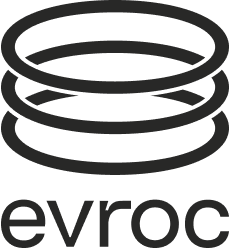

<div align="center">



# evroc Go SDK

**Official Go SDK for the evroc Cloud Platform**

**Simple and Intuitive SDK** for Compute, Networking, IAM, and Storage APIs

</div>

---

## 🚀 Features

- **Easy-to-use Builders** - Fluent builders for ALL resource types
- **Resource Waiters** - Built-in polling for Ready/Deleted states
- **Helper Functions** - Status checks, value extraction, validation
- **Type Safety** - Full type safety with named types
- **OAuth2/OIDC Authentication** - Supports username/password and token-based auth
- **Context Aware** - Project/region context management

## 📦 Installation

```bash
go get github.com/evroc-oss/evroc-go-sdk
```

Requires Go 1.21+

## ⚡ Quick Start

### The Simplest Way - Create VM with Disk in One Line

```go
package main

import (
    "context"
    "log"

    "github.com/evroc-oss/evroc-go-sdk"
    "github.com/evroc-oss/evroc-go-sdk/compute"
)

func main() {
    ctx := context.Background()

    // Create client from environment
    client, err := evroc.NewFromEnv(ctx)
    if err != nil {
        log.Fatal(err)
    }

    // Create VM with disk in ONE line!
    disk, vm, err := compute.CreateVMWithNewDisk(
        ctx,
        client.Compute(),
        "my-vm",                    // VM name
        "my-disk",                  // Disk name
        "ubuntu-minimal.24-04.1",   // OS image
        "a1a.xs",                   // VM size
    )

    log.Printf("Created VM: %s with Disk: %s",
        *vm.Metadata.Name,
        *disk.Metadata.Name)
}
```

## 🛠️ Builder Pattern Examples

### Create a VM with Builder

```go
// Simple VM with builder
vm := compute.NewVirtualMachineBuilder("my-vm").
    WithBootDisk("my-disk").
    WithSize("c1a.m").
    WithSSHKey("ssh-rsa AAAA...").
    Build()

createdVM, err := client.Compute().VirtualMachines().Create(ctx, vm)

// VM with full configuration
vm = compute.NewVirtualMachineBuilder("production-vm").
    WithBootDisk("boot-disk").
    WithDataDisk("data-disk-1").
    WithDataDisk("data-disk-2").
    WithSize("m1a.xl").
    WithSSHKey(sshPublicKey).
    WithCloudInit(cloudInitScript).
    WithSecurityGroup("web-servers").
    WithPublicIP("my-public-ip").
    WithZone("zone-1").
    Build()
```

### Alternative: Direct Construction (Without Builders)

If you prefer not to use the builder pattern, you can construct requests directly:

```go
import (
    computetypes "github.com/evroc-oss/evroc-go-sdk/types/compute"
)

// Direct VM construction
vmReq := &computetypes.VirtualMachineRequest{
    ApiVersion: "compute/v1alpha2",
    Kind:       "VirtualMachine",
    Metadata: computetypes.RegionalMetadataRequest{
        Name: evroc.Ptr("my-vm"),
    },
    Spec: computetypes.VirtualMachineSpec{
        VmVirtualResourcesRef: computetypes.VirtualMachineSpecVmVirtualResourcesRef{
            VmVirtualResourcesRefName: "c1a.m",
        },
        DiskRefs: []computetypes.VirtualMachineSpecDiskRefsItem{
            {
                Name:     "my-disk",
                BootFrom: evroc.Ptr(true),
            },
        },
        OsSettings: &computetypes.VirtualMachineSpecOsSettings{
            Ssh: &struct {
                AuthorizedKeys *[]computetypes.VirtualMachineSpecOsSettingsAuthorizedKeysItem `json:"authorizedKeys,omitempty"`
            }{
                AuthorizedKeys: &[]computetypes.VirtualMachineSpecOsSettingsAuthorizedKeysItem{
                    {Value: evroc.Ptr("ssh-rsa AAAA...")},
                },
            },
        },
        Placement: &computetypes.VirtualMachineSpecPlacement{
            Zone: evroc.Ptr("a"),
        },
        Running: evroc.Ptr(true),
    },
}

createdVM, err := client.Compute().VirtualMachines().Create(ctx, vmReq)
```

Both approaches produce identical results. The builder pattern is recommended for better readability and type safety.

### Create a Disk with Builder

```go
// Simple disk
disk := compute.NewDiskBuilder("my-disk").
    WithImage("ubuntu.24-04.1").
    WithSizeGB(100).
    Build()

createdDisk, err := client.Compute().Disks().Create(ctx, disk)

// Or use convenience methods
bootDisk, err := client.Compute().Disks().CreateBootDisk(
    ctx, "boot-disk", "ubuntu-minimal.24-04.1")

dataDisk, err := client.Compute().Disks().CreateDataDisk(
    ctx, "data-disk", 500) // 500GB data disk
```

### Create Security Groups with Builder

```go
// Web server security group
sg := networking.NewSecurityGroupBuilder("web-servers").
    WithDescription("Security group for web servers").
    AllowSSH("0.0.0.0/0").         // Port 22
    AllowHTTP("0.0.0.0/0").        // Port 80
    AllowHTTPS("0.0.0.0/0").       // Port 443
    AllowPortRange(8000, 8999, "10.0.0.0/8"). // Custom range
    Build()

createdSG, err := client.Networking().SecurityGroups().Create(ctx, sg)

// Database security group - only from web servers
dbSG := networking.NewSecurityGroupBuilder("databases").
    WithDescription("Security group for databases").
    AllowFromSecurityGroup(5432, 5432, "tcp", "web-servers").
    Build()
```

### Create VPC and Subnets

```go
// Create VPC
vpc := networking.NewVPCBuilder("my-vpc").
    WithCIDR("10.0.0.0/16").
    WithDescription("Production VPC").
    WithDNS(true).
    Build()

createdVPC, err := client.Networking().VirtualPrivateClouds().Create(ctx, vpc)

// Create subnets
publicSubnet := networking.NewSubnetBuilder("public-subnet", "my-vpc").
    WithCIDR("10.0.1.0/24").
    WithZone("zone-1").
    WithDescription("Public subnet for web servers").
    Build()

privateSubnet := networking.NewSubnetBuilder("private-subnet", "my-vpc").
    WithCIDR("10.0.2.0/24").
    WithZone("zone-1").
    WithDescription("Private subnet for databases").
    Build()
```

### Create Storage Resources

```go
// Create bucket with builder
bucket := storage.NewBucketBuilder("my-bucket").
    WithDescription("Application data bucket").
    WithVersioning(true).
    WithEncryption(true).
    AddLifecycleRule(30, "temp/").  // Delete temp files after 30 days
    AddCORSRule([]string{"*"}, []string{"GET", "POST"}, []string{"*"}).
    Build()

createdBucket, err := client.Storage().Buckets().Create(ctx, bucket)

// Create bucket with service account
bucket, sa, err := storage.CreateBucketWithReadOnlyAccess(
    ctx,
    client.Storage(),
    "backup-bucket",
    "backup-reader",
)

// Or use predefined bucket types
staticBucket, err := storage.CreateStaticWebsiteBucket(
    ctx, client.Storage().Buckets(), "website-bucket")

backupBucket, err := storage.CreateBackupBucket(
    ctx, client.Storage().Buckets(), "backup-bucket")
```

### Create IAM Resources

```go
// Create project with builder
project := iam.NewProjectBuilder("dev-project").
    WithDescription("Development environment").
    WithEnvironmentTag("development").
    WithOwnerTag("team-alpha").
    WithVMQuota(50).
    WithDiskQuota(100).
    WithStorageQuota(5000). // 5TB
    Build()

createdProject, err := client.IAM().Projects().Create(ctx, project)

// Create permission set with builder
permissions := iam.NewPermissionSetBuilder("developer-permissions").
    WithDescription("Standard developer access").
    AddComputePermissions(false).     // Full compute access
    AddNetworkingPermissions(false).  // Full networking access
    AddStoragePermissions(false).     // Full storage access
    AddIAMPermissions(true).          // Read-only IAM
    Build()

// Or use predefined permission sets
adminPerms, err := iam.CreateAdminPermissionSet(
    ctx, client.IAM().PermissionSets(), "admin-role")

readOnlyPerms, err := iam.CreateReadOnlyPermissionSet(
    ctx, client.IAM().PermissionSets(), "viewer-role")
```

## 🔧 Configuration

### Environment Variables

```bash
export EVROC_USERNAME="user@evroc.com"
export EVROC_PASSWORD="your-password"
export EVROC_PROJECT="project-uuid"
export EVROC_REGION="se-sto"
export EVROC_ORGANIZATION="org-uuid"
```

```go
client, err := evroc.NewFromEnv(ctx)
```

### Configuration File

Create `config.yaml`:

```yaml
auth:
  username: "user@evroc.com"
  password: "your-password"

context:
  project: "project-uuid"
  region: "se-sto"
  organization: "org-uuid"
```

```go
client, err := evroc.NewFromFile(ctx, "config.yaml")
```

### Programmatic Configuration

```go
cfg := &config.Config{
    Auth: config.AuthConfig{
        Username: "user@evroc.com",
        Password: "your-password",
    },
    Context: config.ContextConfig{
        Project:      "project-uuid",
        Region:       "se-sto",
        Organization: "org-uuid",
    },
}

client, err := evroc.New(ctx, cfg)
```

### Custom HTTP Client (Testing)

For testing or when you need custom HTTP behavior, use the functional options pattern:

```go
// Custom HTTP client for testing
customClient := &http.Client{
    Timeout: 30 * time.Second,
    Transport: &mockTransport{}, // Your test transport
}

client, err := evroc.NewFromEnv(ctx, evroc.WithHTTPClient(customClient))
if err != nil {
    log.Fatal(err)
}

// Or with programmatic config
client, err := evroc.New(ctx, cfg, evroc.WithHTTPClient(customClient))
```

## 📚 Helper Functions

### Status Checking

```go
// Check if resources are ready
if compute.IsVMReady(vm) {
    log.Println("VM is ready!")
}

if compute.IsDiskReady(disk) {
    log.Println("Disk is ready!")
}

if networking.IsPublicIPReady(publicIP) {
    ipAddress := networking.GetPublicIPAddress(publicIP)
    log.Printf("Public IP ready: %s", ipAddress)
}

// Get VM state
state := compute.GetVMState(vm)
log.Printf("VM State: %s", state)
```

### Working with Optional Fields

Many API response fields are pointers to allow for optional/unset values. Handle them correctly:

```go
// Check if field is set before using
if vm.Metadata.Name != nil {
    log.Printf("VM Name: %s", *vm.Metadata.Name)
}

// For fields that are always present after creation, direct dereference is safe
vmName := *vm.Metadata.Name  // Safe - name is always set on created resources

// For optional fields, provide explicit defaults
running := true  // API default
if vm.Spec.Running != nil {
    running = *vm.Spec.Running
}
```

Note: The generic `evroc.Ptr()` helper is only needed if you're using direct construction instead of builders.

### Validation Helpers

```go
// Validate before creating
err := compute.ValidateDiskSize(500, "GB")
err := compute.ValidateVMSize("a1a.xs")
```

### Error Handling

The SDK provides typed errors that can be checked using the standard library's `errors.Is()`:

```go
import (
    "errors"
    "github.com/evroc-oss/evroc-go-sdk/rest"
)

// Check for specific HTTP status codes
vm, err := client.Compute().VirtualMachines().Get(ctx, "my-vm")
if errors.Is(err, rest.ErrNotFound) {
    log.Println("VM not found")
} else if errors.Is(err, rest.ErrForbidden) {
    log.Println("Access denied")
} else if err != nil {
    log.Printf("API error: %v", err)
}

// Check for conflicts when creating resources
disk, err := client.Compute().Disks().Create(ctx, diskReq)
if errors.Is(err, rest.ErrConflict) {
    log.Println("Disk already exists")
}

// Access detailed error information
var apiErr *rest.APIError
if errors.As(err, &apiErr) {
    log.Printf("Status: %d, Reason: %s", apiErr.StatusCode, apiErr.Reason)
}
```

Available sentinel errors:
- `rest.ErrNotFound` (404) - Resource not found
- `rest.ErrConflict` (409) - Resource already exists
- `rest.ErrForbidden` (403) - Access denied
- `rest.ErrBadRequest` (400) - Invalid request

## 📖 Full Examples

Check out the `examples/` directory for complete working examples:

- **examples/simple/** - Minimal quick start showing basic SDK usage
- **examples/create-vm/** - Step-by-step VM creation with disk, public IP, and SSH
- **examples/compute/** - Complete Compute API coverage (Disks, VMs, PlacementGroups, Hotswap)
- **examples/networking/** - Complete Networking API coverage (PublicIPs, SecurityGroups, VPCs, Subnets)
- **examples/storage/** - Complete Storage API coverage (Buckets, BucketServiceAccounts)
- **examples/iam/** - Complete IAM API coverage (Projects, PermissionSets)
- **examples/labels/** - Label filtering and organization across all resource types

See [examples/README.md](examples/README.md) for detailed documentation on each example.

## 🎯 Common Operations

### Create and Wait for Resources

```go
// Create disk
disk := compute.NewDiskBuilder("my-disk").
    WithImage("ubuntu.24-04.1").
    WithSizeGB(50).
    Build()

createdDisk, err := client.Compute().Disks().Create(ctx, disk)

// Wait for disk to be ready
for i := 0; i < 30; i++ {
    disk, _ = client.Compute().Disks().Get(ctx, "my-disk")
    if compute.IsDiskReady(disk) {
        break
    }
    time.Sleep(5 * time.Second)
}

// Create VM using the disk
vm := compute.NewVirtualMachineBuilder("my-vm").
    WithBootDisk("my-disk").
    WithSize("a1a.xs").
    Build()

createdVM, err := client.Compute().VirtualMachines().Create(ctx, vm)
```

### List and Filter Resources

```go
// List all VMs
vms, err := client.Compute().VirtualMachines().List(ctx)
for _, vm := range vms.Items {
    state := compute.GetVMState(&vm)
    log.Printf("VM: %s (State: %s)", *vm.Metadata.Name, state)
}

// List all disks
disks, err := client.Compute().Disks().List(ctx)
for _, disk := range disks.Items {
    if compute.IsDiskReady(&disk) {
        log.Printf("Ready disk: %s", *disk.Metadata.Name)
    }
}
```

### Update Resources

```go
// Stop a VM
stoppedVM, err := client.Compute().VirtualMachines().StopVM(ctx, "my-vm")

// Start a VM
startedVM, err := client.Compute().VirtualMachines().StartVM(ctx, "my-vm")

// Resize a disk
resizedDisk, err := client.Compute().Disks().ResizeDisk(ctx, "my-disk", 200)

// Attach disk to VM
updatedVM, err := client.Compute().VirtualMachines().AttachDiskToVM(
    ctx, "my-vm", "additional-disk")
```

### Delete Resources

```go
// Delete VM
err := client.Compute().VirtualMachines().Delete(ctx, "my-vm")

// Delete disk
err := client.Compute().Disks().Delete(ctx, "my-disk")

// Delete security group
err := client.Networking().SecurityGroups().Delete(ctx, "web-servers")
```

## 🏗️ Architecture

The SDK is structured into service modules:

- **compute/** - VirtualMachines, Disks, PlacementGroups, Builders
- **networking/** - PublicIPs, SecurityGroups, VPCs, Subnets, Builders
- **storage/** - Buckets, BucketServiceAccounts, Builders
- **iam/** - Projects, PermissionSets, Builders
- **helpers.go** - Common helper functions for all services

Each service provides:
- **Builders** - Fluent interface for creating resources
- **Service Methods** - CRUD operations (Create, Read, Update, Delete, List)
- **Helper Methods** - Convenience wrappers for common operations

## 🤝 Contributing

Contributions are welcome! Please feel free to submit a Pull Request.

## 📄 License

This project is licensed under the MIT License - see the [LICENSE](LICENSE) file for details.

## 📞 Support

For support, please contact support@evroc.com or open an issue on GitHub.

---

<div align="center">
Made with ❤️ by the evroc team
</div>